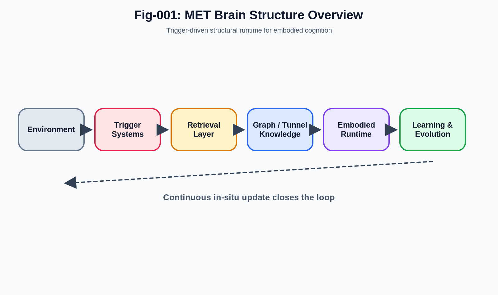
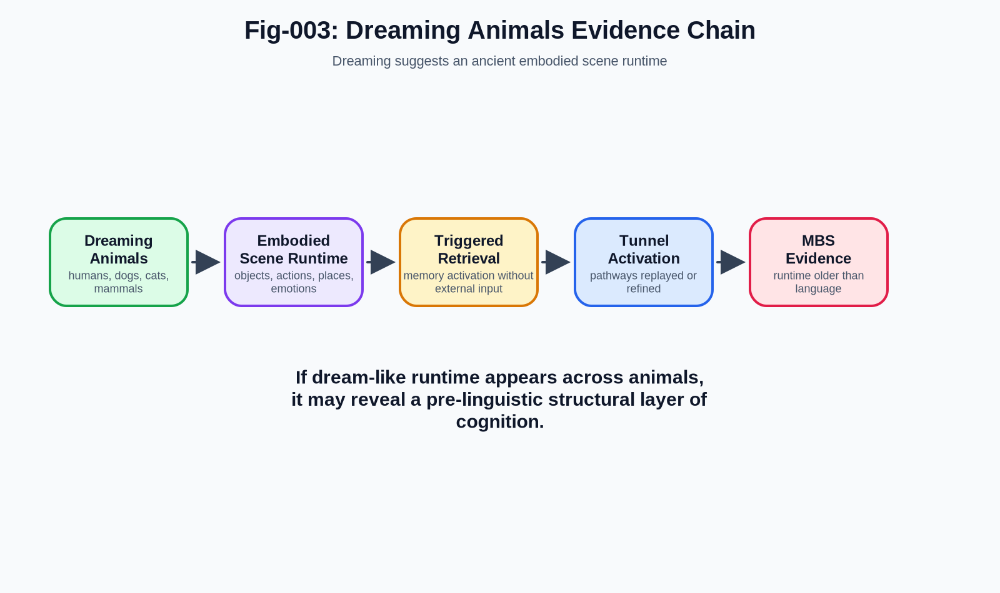
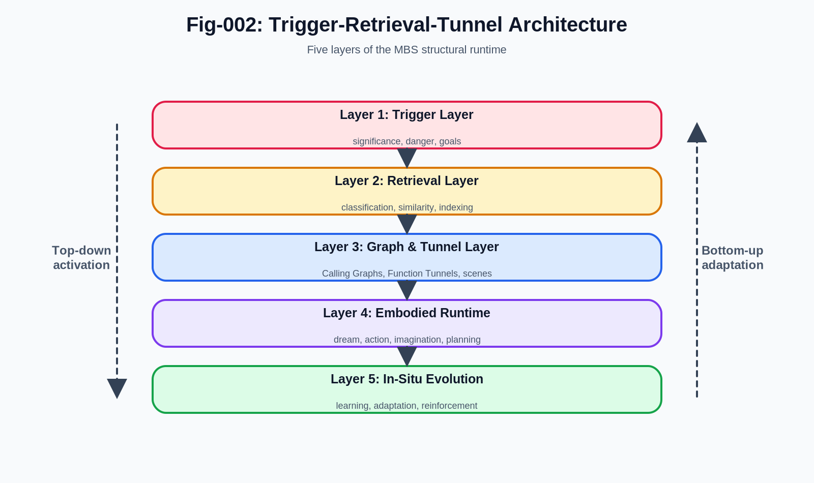
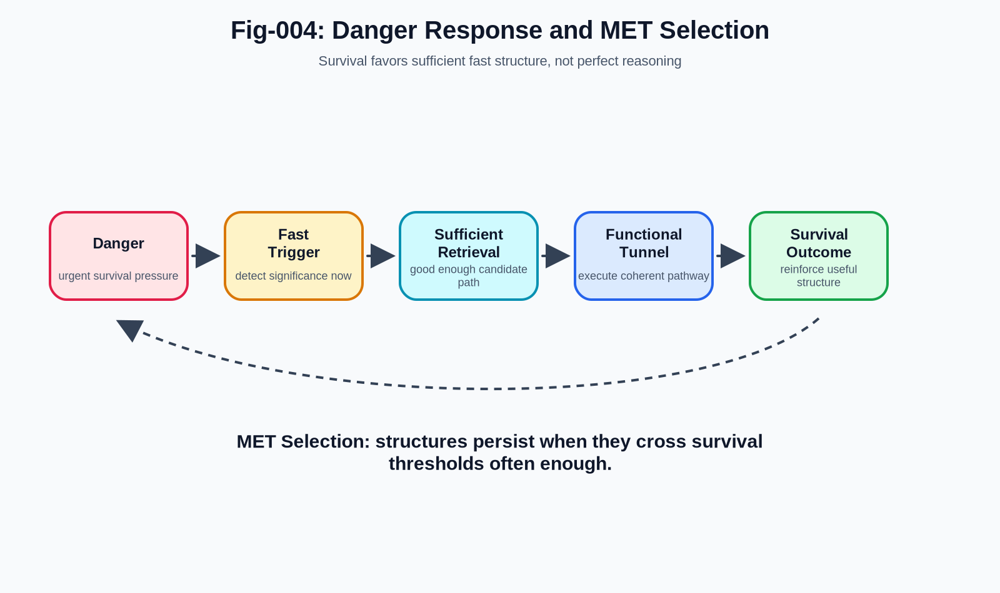
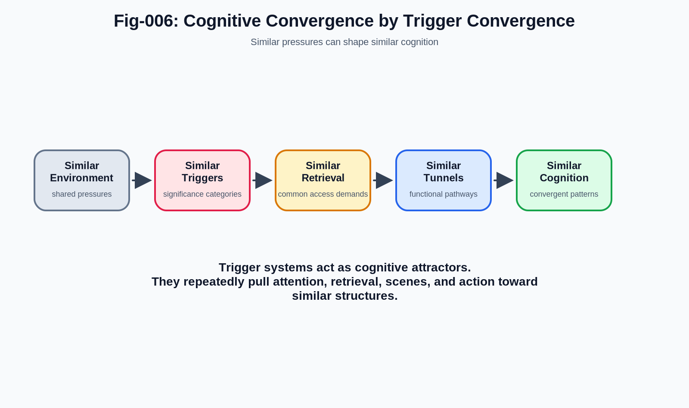
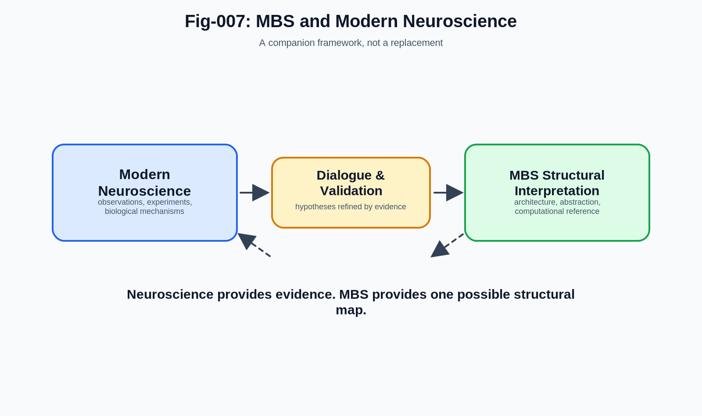
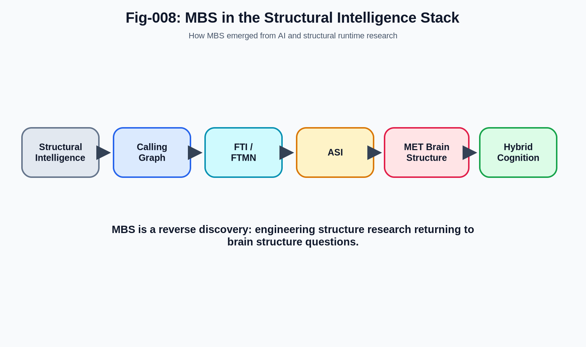

# MET Brain Structure (MBS)
## A Structural Runtime Hypothesis for Embodied Cognition, Dreaming, Retrieval, Learning, and Cognitive Convergence

## What Is This Repository?

This repository introduces **MET Brain Structure (MBS)**, an exploratory structural hypothesis about biological cognition.

MBS proposes that many cognitive phenomena may be understood through a common structural runtime architecture involving:

- Trigger systems
- Retrieval structures
- Graph and tunnel knowledge
- Embodied scene runtime
- In-situ learning and evolution

The project emerged from research in **Structural Intelligence, Calling Graphs, Function Tunnel Intelligence, Function Tunnel Math and Networks, and Autonomous Structural Intelligence**.

MBS is not intended to replace neuroscience.

It is intended to provide a complementary structural model that may help organize observations from neuroscience, cognitive science, animal behavior, artificial intelligence, and embodied cognition.

## Core Question

The central question of MBS is:

> What minimal structural architecture could simultaneously support dreaming, danger response, embodied cognition, retrieval, learning, simulation, cognitive convergence, and continuous in-situ adaptation?

This question is approached from the perspective of **Minimal Evolution Threshold (MET)**.

The MET perspective does not assume that evolution builds optimal systems.

Instead, it asks:

> What structures are sufficiently useful, sufficiently fast, and sufficiently adaptive to be preserved and expanded by evolution?

## Core Hypothesis

MBS proposes that biological cognition may often operate through a runtime flow resembling:

    Environment
        ↓
    Trigger Systems
        ↓
    Retrieval Layer
        ↓
    Graph / Tunnel Knowledge Structures
        ↓
    Embodied Scene Runtime
        ↓
    Action / Simulation
        ↓
    Learning and In-Situ Evolution

This differs from a classical computer metaphor:

    Memory
        ↓
    CPU
        ↓
    Decision

MBS suggests that cognition may be less like centralized symbolic computation and more like continuous activation, traversal, simulation, and evolution of embodied structures.

## Why Dreaming Animals Matter

One important motivation comes from dreaming animals.

Humans dream.

Dogs appear to dream.

Cats appear to dream.

Many mammals show dream-like sleep behavior.

This matters because dreaming appears to exist far below language, mathematics, formal reasoning, and civilization.

Dreaming may therefore expose an ancient structural runtime system involving:

    Trigger
        ↓
    Retrieval
        ↓
    Scene Activation
        ↓
    Function Tunnel Activation
        ↓
    Simulation / Replay / Adaptation

From the MBS perspective, dreaming is not treated as random imagery.

It may be evidence of an embodied scene runtime that supports memory, learning, simulation, and functional pathway refinement.

## Trigger-Retrieval-Tunnel Architecture

The core architecture of MBS contains five layers:

#### 1. Trigger Layer
Detects significance, danger, opportunity, novelty, goals, and emotional cues.

#### 2. Retrieval Layer
Locates relevant memory, scenes, pathways, and structural candidates.

#### 3. Graph and Tunnel Knowledge Layer
Organizes states, actions, functional pathways, scene relationships, and behavioral routines.

#### 4. Embodied Runtime Layer
Activates scenes, simulations, dreams, plans, memories, and actions.

#### 5. In-Situ Evolution Layer
Continuously modifies triggers, retrieval paths, tunnels, and scene structures through experience.

## Danger Response and MET Selection

Danger may be one of the strongest evolutionary forces shaping cognition.

An organism facing immediate threat cannot rely on slow exhaustive reasoning.

It needs:

    Fast Detection
        ↓
    Fast Retrieval
        ↓
    Fast Pathway Activation
        ↓
    Sufficient Action

This is a natural MET process.

The system does not need to be perfect.

It only needs to cross the survival threshold often enough.

Over evolutionary time, this pressure may reinforce trigger systems, retrieval structures, functional tunnels, and scene-based simulation mechanisms.

## Embodied Scene Runtime

MBS proposes that scenes may be one of the major runtime units of cognition.

Memory, dreaming, imagination, navigation, planning, and prediction may all involve activation of embodied scenes.

A scene may contain:

- Objects
- Space
- Agents
- Actions
- Emotional context
- Goals
- Expected transitions
- Available functional tunnels

In this view, cognition is not always assembled from isolated symbols.

It often begins by activating an embodied scene with built-in context and action possibilities.

## Cognitive Convergence

MBS also proposes a trigger-centered interpretation of cognitive convergence.

Different organisms and individuals often face similar environments and survival pressures.

This may produce similar trigger categories.

Similar triggers may produce similar retrieval demands.

Similar retrieval demands may produce similar functional tunnels.

Similar tunnels may produce similar cognitive patterns.

In short:

    Similar Environment
        ↓
    Similar Triggers
        ↓
    Similar Retrieval
        ↓
    Similar Function Tunnels
        ↓
    Similar Cognition

This is the Trigger Convergence hypothesis.

## Relationship to Neuroscience

MBS is not a replacement for neuroscience.

Neuroscience provides:

- Observations
- Experiments
- Biological mechanisms
- Imaging evidence
- Behavioral data
- Clinical insights

MBS attempts to provide:

- Structural abstraction
- Architectural interpretation
- Cross-domain organization
- Computational analogies
- Digital model references

The goal is collaboration, not competition.

MBS stands on the shoulders of neuroscientists, cognitive scientists, psychologists, ethologists, and brain researchers whose work provides the foundation for any meaningful model of cognition.

## Relationship to AI and ASI

MBS emerged from a long research path:

    Structural Intelligence
        ↓
    Calling Graph
        ↓
    Function Tunnel Intelligence
        ↓
    Function Tunnel Math and Networks
        ↓
    Autonomous Structural Intelligence
        ↓
    MET Brain Structure

This makes MBS a bridge between biological cognition and artificial intelligence.

It suggests that future AI systems may need more than language modeling.

They may require:

- Trigger architectures
- Retrieval governance
- Scene-centered runtime
- Function tunnel execution
- Continuous structural adaptation

## Suggested Reading Order

    MBS-001-START-HERE.md
    MBS-002-MBS-CORE-THESIS.md
    MBS-003-WHY-DREAMING-ANIMALS-MATTER.md
    MBS-004-TRIGGER-RETRIEVAL-TUNNEL-ARCHITECTURE.md
    MBS-005-DANGER-RESPONSE-AND-MET-SELECTION.md
    MBS-006-EMBODIED-SCENE-RUNTIME.md
    MBS-007-COGNITIVE-CONVERGENCE.md
    MBS-008-RELATION-TO-MODERN-NEUROSCIENCE.md
    MBS-009-RELATION-TO-AI-AND-ASI.md
    MBS-010-FUTURE-DIRECTIONS.md
    MBS-011-TRIGGER-CHANNELS-ARE-NOT-HACKS.md
    
    Figure Index
    Fig-001-MBS-Overview
    Fig-002-Trigger-Retrieval-Tunnel-Architecture
    Fig-003-Dreaming-Animals-Evidence-Chain
    Fig-004-Danger-Response-MET-Selection
    Fig-005-Embodied-Scene-Runtime
    Fig-006-Cognitive-Convergence-by-Trigger-Convergence
    Fig-007-MBS-and-Neuroscience-Companion-Framework
    Fig-008-MBS-in-Structural-Intelligence-Stack

## Research Position

MBS is exploratory.

It does not claim final answers.

It proposes a structural map.

Some parts may prove useful.

Some parts may require revision.

Some parts may be replaced by future neuroscience evidence.

That is expected.

The purpose of this repository is to open a research direction:

> toward a structural science of biological, artificial, and hybrid cognition.

---

## Author

Sizhe Tan\
Independent Researcher

GPT-Obot\
AI Research Assistant

2026

## Citation

DOI: TBD

## License

Apache-2.0

---

## 📚 DBM-SI Series Navigation

See:\
[./docs/DBM-SI-Series-of-gitHub-Repositories/DBM-SI-Series-of-gitHub-Repositories.md](./docs/DBM-SI-Series-of-gitHub-Repositories/DBM-SI-Series-of-gitHub-Repositories.md)

[./docs/DBM-SI-Series-of-gitHub-Repositories/DBM-SI-Structural-Intelligence-Dictionary-(v2).md](./docs/DBM-SI-Series-of-gitHub-Repositories/DBM-SI-Structural-Intelligence-Dictionary-(v2).md)

