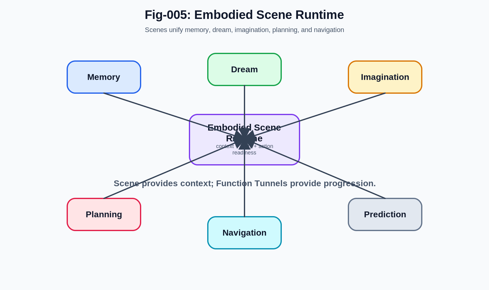

# MBS-006 - Embodied Scene Runtime
## A Structural Interpretation of Dreaming, Memory, Imagination, Navigation, and Planning

## Introduction

Human cognition is often described through the language of symbols.

    Concepts.
    
    Words.
    
    Rules.
    
    Logic.
    
    Representations.
    
    Reasoning.

These descriptions are useful and powerful.

However, they may overlook a deeper layer of biological intelligence.

    When people remember.
    
    When they dream.
    
    When they imagine.
    
    When they navigate.
    
    When they anticipate danger.
    
    When they plan future actions.

They frequently do not experience abstract symbols.

Instead, they experience scenes.

    Places.
    
    Objects.
    
    Movement.
    
    Relationships.
    
    Goals.
    
    Emotions.

    Events unfolding through time.

The MET Brain Structure (MBS) project proposes that these observations point toward an important possibility:

> Biological cognition may operate through an Embodied Scene Runtime.

Rather than treating scenes as secondary products of cognition, this perspective considers scenes to be one of the primary runtime units of intelligence.

## The Strange Efficiency of Human Scene Generation

One observation immediately stands out.

Humans can generate extraordinarily rich scenes with remarkable speed.

A single phrase can trigger:

    A city.
    
    A childhood memory.
    
    A dangerous situation.
    
    A conversation.
    
    A future possibility.
    
    An entire imagined world.

This process often occurs almost instantly.

The resulting scene may contain:

- Spatial structure
- Objects
- Actions
- Emotional context
- Social relationships
- Expectations
- Potential futures

The amount of information involved appears far greater than what is explicitly represented in language.

This suggests the existence of highly efficient mechanisms for scene retrieval and scene construction.

## Dreams as Runtime Demonstrations

Dreaming provides perhaps the clearest demonstration of scene generation capability.

During dreams, people often experience:

- Locations
- Characters
- Movement
- Goals
- Threats
- Social interactions
- Narratives

These experiences frequently appear coherent despite the absence of direct sensory input.

The same phenomenon appears, to varying degrees, across many animal species.

Dreaming therefore reveals an important fact:

> The brain is capable of constructing active experiential environments internally.

This capability likely did not evolve solely for dreaming.

Dreams may simply expose a system that already exists for other purposes.

## Beyond Memory Storage

Traditional discussions often focus on memory storage.

The MBS perspective asks a different question:

> How are memories activated and experienced?

Remembering is rarely experienced as retrieving isolated data records.

Instead, remembering often involves entering a scene.

    A childhood home.
    
    A classroom.
    
    A conversation.
    
    A particular road.
    
    A specific event.

The memory arrives as a structured experiential environment.

This observation suggests that retrieval may often target scenes rather than individual facts.

## Scene as a Cognitive Unit

From the MBS perspective, a scene may represent a natural cognitive unit.

A scene can include:

- Objects
- Locations
- States
- Actions
- Agents
- Emotions
- Goals
- Relationships
- Expected transitions

Importantly, scenes already contain context.

This dramatically reduces the need for explicit reconstruction.

Instead of assembling cognition from isolated symbols, the brain may activate pre-organized scene structures.

## Embodiment Matters

The term embodied is critical.

Scenes are not merely visual images.

They may also include:

- Body posture
- Movement possibilities
- Sensory expectations
- Emotional responses
- Action readiness

A scene is not simply observed.

A scene is inhabited.

This distinction may explain why imagined experiences often produce genuine emotional and physiological reactions.

The runtime system does not merely display information.

It partially recreates experiential conditions.

## Relationship to Trigger Systems

Scene activation rarely occurs randomly.

Scenes are typically triggered.

    A smell.
    
    A sound.
    
    A word.
    
    A location.
    
    A facial expression.
    
    A danger signal.
    
    A goal.

These triggers activate retrieval systems.

Retrieval systems activate relevant scene structures.

The scene then becomes active within the runtime.

This creates a natural flow:

    Trigger
    
    ↓
    
    Retrieval
    
    ↓
    
    Scene Activation
    
    ↓
    
    Runtime Experience

## Relationship to Function Tunnels

Scenes alone are not sufficient.

Most scenes imply possible actions.

A scene often contains:

    What exists.
    
    What is happening.
    
    What might happen next.
    
    What actions are available.

This is where Function Tunnels become important.

Function Tunnels connect scenes through functional transitions.

For example:

    Threat Scene
    
    ↓
    
    Escape Tunnel
    
    ↓
    
    Safe Scene

Or:

    Food Opportunity Scene
    
    ↓
    
    Acquisition Tunnel
    
    ↓
    
    Consumption Scene

The Embodied Scene Runtime therefore does not replace Function Tunnel Networks.

It operates through them.

Scenes provide context.

Tunnels provide progression.

Together they create dynamic cognition.

## Memory, Imagination, and Planning

One of the most interesting implications of the scene perspective is the apparent similarity among:

    Memory.
    
    Imagination.
    
    Planning.
    
    Prediction.

These activities may differ less than traditionally assumed.

All involve activation of internal scenes.

Memory emphasizes historical scenes.

Imagination emphasizes hypothetical scenes.

Planning emphasizes future scenes.

Prediction emphasizes anticipated scenes.

The runtime mechanisms supporting them may be closely related.

## Navigation as Scene Traversal

Navigation provides another useful example.

When humans move through familiar environments, they often do not rely on explicit symbolic reasoning.

Instead, they move through sequences of remembered and anticipated scenes.

    Current Scene
    
    ↓
    
    Expected Next Scene
    
    ↓
    
    Target Scene

This process resembles traversal within a scene graph.

The same principle may apply to many forms of cognition.

## Dreaming as Autonomous Scene Runtime

Dreaming can now be viewed from a new perspective.

Rather than:

    Dream = Random Imagery

MBS proposes:

    Dream = Autonomous Scene Runtime

The dream system may activate:

- Existing scenes
- Modified scenes
- Combined scenes
- Simulated scenes

without direct external input.

The resulting experience reflects the operation of a powerful internal scene-generation mechanism.

## Why Evolution Would Favor Scene-Based Cognition

Scene-based cognition offers several advantages.

    Speed.
    
    Context preservation.
    
    Action readiness.
    
    Efficient retrieval.
    
    Low reconstruction cost.

A scene can activate large amounts of relevant information simultaneously.

This may be far more efficient than reconstructing situations from isolated symbolic elements.

From a **Minimal Evolution Threshold** perspective, scene activation may represent an economical and effective evolutionary solution.

## Relationship to Modern Neuroscience

Modern neuroscience has identified numerous systems involved in:

- Memory
- Spatial navigation
- Mental imagery
- Dreaming
- Predictive processing
- Embodied cognition

The Embodied Scene Runtime hypothesis does not attempt to replace these findings.

Instead, it proposes a structural interpretation.

Many observed mechanisms may participate in the construction, activation, maintenance, and evolution of internal scene structures.

Future neuroscience research will ultimately determine the validity of this interpretation.

## Implications for Artificial Intelligence

Most contemporary AI systems remain heavily language-centered.

Even multimodal systems often process information through symbolic or token-based pathways.

The MBS perspective suggests another possibility.

Future intelligence systems may require:

- Scene-centered representations
- Trigger-driven activation
- Functional tunnel execution
- Runtime simulation
- Continuous structural adaptation

In such systems, scenes become operational structures rather than passive representations.

This may bring artificial systems closer to the dynamics of biological cognition.

## Conclusion

The Embodied Scene Runtime hypothesis proposes that scenes may be among the most important runtime structures in biological intelligence.

    Dreaming.
    
    Memory.
    
    Imagination.
    
    Planning.
    
    Prediction.
    
    Navigation.

These phenomena may all depend upon the activation and evolution of embodied scene structures.

Within the broader MET Brain Structure framework, scenes provide context while Function Tunnels provide progression.

Together they form a dynamic runtime capable of supporting complex cognition without requiring every experience to be reconstructed from isolated symbols.

From this perspective, intelligence may not primarily operate through abstract representations.

It may operate through the continuous activation, traversal, modification, and evolution of embodied scenes.